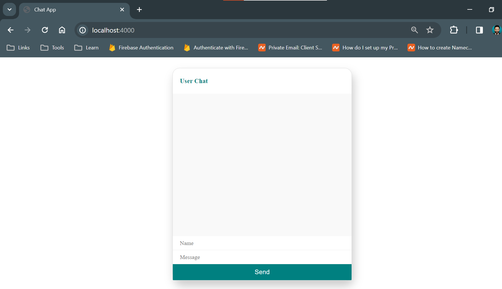
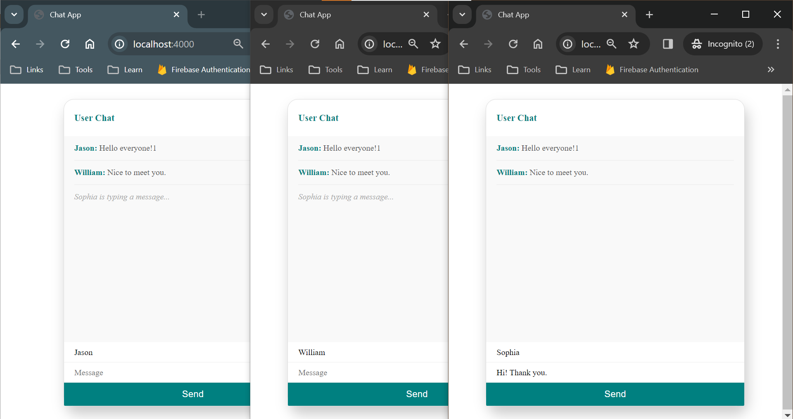
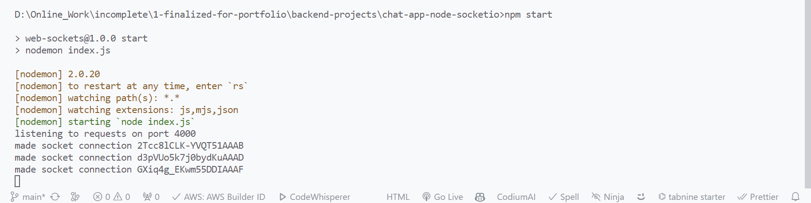

# Chat App

## Details

### Brief description

this is a websocket chat application using socket.io

### Features

multiple users can chat with each other in real time

### Technologies used

html, css, javascript

#### Dependencies

express, socket.io

#### Dev dependencies

nodemon

## Getting Started

### Pre-requisites

Node.js, NPM, code editor like VSCode.

### Install project dependencies

```bash
npm install
```

### Run development server

```bash
npm start
```

Open [http://localhost:4000](http://localhost:4000) with your browser to see the result.

## Screenshots




